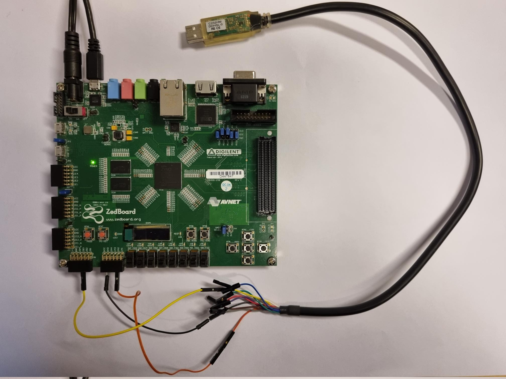

# InterPRET

InterPRET is a multicore FlexPRET architecture that uses a time-predictable Network on Chip (NoC) for the communication between FlexPRET cores.

## Getting started

### Prerequisites
1. Verilator
2. SBT
3. RISCV 32-bit toolchain

### Clone repo and set up 
```
git clone git@github.com:lf-lang/interpret.git --recursive
cd interpret
source env.bash
```


### Build and run tests
```
make test
```
The final tests, which consist of bootloading an application over serial might take a few minutes to complete.


### Run HelloWorld example
1. Build an emulator of a quad-core InterPRET
```
make clean && make emulator N_CORES=4 THREADS=4
```
2. Compile an example program
```
cd programs/noc/HelloWorld
riscv-compile.sh 4 ispm hello_noc.c
```

This compiles a program assuming 4 hardware threads (which must match the numbers used to build the emulator).
The compiled binary is stored in a file called `ispm.mem`. The emulator will expect to find such a file in the directory
where you are invoking the emulator.

```
fp-emu
```

Which should return
```
Core-0 is done
Core-1 is done
Core-2 is done
Core-3 is done
All cores are done terminating
Assertion failed: Program terminated sucessfully
    at Top.scala:126 assert(false.B, "Program terminated sucessfully")
[174526] %Error: Top.sim.v:33181: Assertion failed in TOP.Top
%Error: Top.sim.v:33181: Verilog $stop
Aborting...
```

which is a successful termination of the emulator.


## Running the InterPRET on an FPGA

### Prerequisites
1. A Zedboard FPGA
2. Vivado v2021.2 (more recent versions should also work fine) on PATH
3. A USB->UART adapter. E.g. [This](https://ftdichip.com/products/c232hm-ddhsl-0-2/) FTDI adapter
4. Three male-to-male jumper cables


### Synthesizing and programming the FPGA
1. Make sure your ZedBoard is powered and connected to your PC through a micro-USB cable connected to the J20 PROG port of the Zedboard.
2. Generate Verilog for FPGA synthesis
```
make clean && make fpga
```
3. Build the bootloader and copy it into the fpga build directory
```
cd programs/bootloader
make
cp ispm.mem ../../fpga/
```
This program, containing the bootloader, will be synthesized together with the circuit and be programmed onto the on-chip BRAMs of the Zedboard.

4. Run Vivado to synthesize, implement and program the FPGA
```
cd ../../fpga
vivado -mode batch -source runVivadoZed.tcl
```

This can take ~5-10 minutes depending on your platform. The last step will program the bitstream onto the Zedboard. This requires the Zedboard to be powered and connected.
The final bitstream will be stored in a file called `zedboard.bit` which can later be used to reprogram the Zedboard if you want to reset the InterPRET.
When this step completes you should see the blue `DONE` LED light up. Also, LED0 and LED1 should shine red. This means that the bootloader is running and that it is waiting for data on the UART port.

### Compiling applications to be bootloaded onto the InterPRET
Now we will compile a simple blinky program to be bootloaded onto the InterPRET. It is similar to compiling it for the emulated InterPRET, but it must be linked differently because there is already a bootloader in the ISPM.
```
cd programs/blinky
compile_app 4 blinky blinky.c
```

This will produce the file `blinky.app` which is ready for bootloading. It has wrapped the binary in a simple protocol using `~/programs/scripts/serialize_app.py`.

### Connecting to the ZedBoard
In the constraint file `zedboard.xdc` the Zedboard is configured with pin JA2 connected to UART_RX. To bootload an application we must connect the TX wire of our USB-UART adapter to this pin. This is shown in Fig. 1. Here we have also connected the RX wire of the adpater to JB7 which is the pin used for printing. This will be used in the next example. 


Fig.1 Zedboard connected to a FTDI USB UART adapter


### Bootloading the InterPRET
1. Connect the USB-UART adapter to your PC (running Ubuntu)
2. Find out its device path `dmesg | tail`. This is typically `dev/ttyUSB0` or similar
3. Send the application:

```
send_uart.py /dev/ttyUSB0 115200 blinky.app
```

Then you will see the LEDs changing (this is debug-info from the bootloader), before, after a second, the `blinky` application starts.
It should use the 8 LEDs as a binary up-counter.
`send_uart.py` will not terminate but will print out whatever data it receives (with a buadrate of 115200) on its RX wire. This will be used in the later printing example.


### Printing from the InterPRET
1. To print out debug info from the InterPRET please make sure that you have connected the RX wire of the USB-UART adapter to JB7 as shown in Fig. 1.
2. Then compile the example printing application
```
cd programs/print
compile_app 4 print print.c
```

3. Reset the Zedboard so it is in the bootloader waiting for the application over UART. LED0 and LED1 should shine red.
4. Send the application over UART

```
send_uart.py /dev/ttyUSB0 115200 print.app
```

The `send_uart` script should print the following:
```
$ send_uart.py /dev/ttyUSB0 115200 print.app                                                                      (base) 
Hello from t1
Hello from t2
42
```

### Reprogramming the ZedBoard
To re-program the Zedboard without re-running synthesis do
```
vivado -mode batch -source programZed.tcl
```
this uses the file `zedboard.bit` which is generated by `runVivadoZed.tcl`. 

This script takes around 20 secs to program the Zedboard. A more efficient way is to open Vivado in TCL mode
and reprogram it with a single command.

```
vivado -mode tcl
Vivado% source programZed.tcl
Vivado% program_hw_devices
```

After the initial sourcing of the `programZed.tcl` you can re-program by simply invoking `program_hw_devices`. This takes about 3 seconds.


## Running benchmarks and case studies from TCRS'23

## Debugging
To get waveforms build the InterPRET with TRACE=1, e.g.
`make emulator N_CORES=1 TRACE=1`
